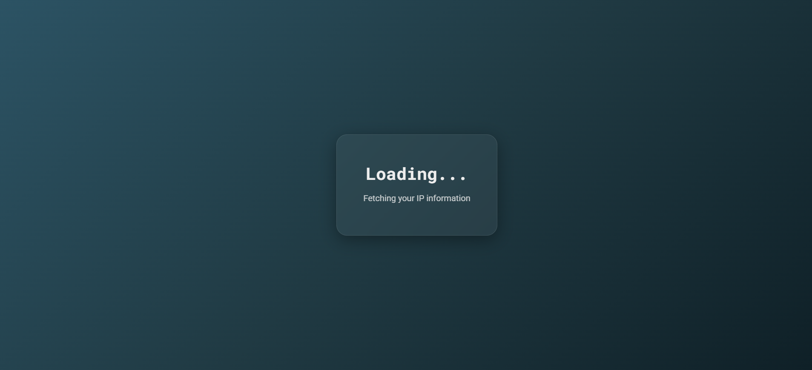
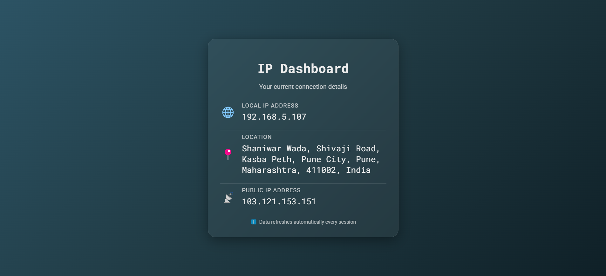

---

# IP Info Dashboard

Here’s a preview of what the application looks like:




## Introduction

The **IP Info Dashboard** is a web application built using **FastAPI** for the backend and **React** for the frontend. It provides a simple and interactive interface to view key information about the user's network connection, including:

- Local IP address
- Public IP address
- Geolocation based on the public IP (city, region, and country)

This project serves as a tool for quickly retrieving your network details and understanding your connection better, especially when working with networking applications, diagnosing issues, or testing different configurations.

## Use Case

In many scenarios, developers or users may need to retrieve IP-related details such as:

- **Network Troubleshooting**: Determining your public and local IP addresses can help troubleshoot network-related issues.
- **Geolocation Services**: Sometimes, knowing the geographic location of the IP address is necessary to provide localized content or services.
- **IP Address Management**: This tool can assist in identifying and tracking network devices by their IP addresses.

This app is particularly useful for:

- System administrators who need to view connection data quickly.
- Developers who require access to IP information for debugging or setting up network-related features in their applications.
- Anyone curious about their public and local IP and their geographical location.

## Problem Faced

During the development of networking applications or when setting up servers, I often found myself manually checking the local and public IP addresses, as well as the geolocation, which is a tedious and time-consuming task. To streamline this process and to gain quick access to all this data, I decided to build this simple dashboard application. The challenge was ensuring that the application could fetch the local IP and accurately detect the public IP, as well as provide relevant location information using reliable APIs.

By combining **FastAPI** for the backend and **React** for the frontend, this project solves the problem of quickly displaying this information in an easy-to-read format and is a useful tool for anyone needing to monitor or manage their network connection.

## Features

- Retrieve both **local IP address** and **public IP address**.
- Automatically fetch and display the **geolocation** of the public IP.
- Display all details in a user-friendly **React-based frontend**.
- Real-time data refresh with every session.

## Technology Stack

- **Backend**: FastAPI, Python
- **Frontend**: React.js
- **IP Geolocation**: ipify, ipinfo.io, Geopy (Nominatim)
- **Networking**: socket, requests
- **CORS Support**: Managed with CORSMiddleware for cross-origin requests

## How to Run the Project

1. Clone the repository: `git clone <repository-url>`
2. Install dependencies for backend:
   ```bash
   pip install -r requirements.txt
   ```
3. Run the FastAPI app:
   ```bash
   uvicorn main:app --reload
   ```
4. Install frontend dependencies:
   ```bash
   npm install
   ```
5. Start the React development server:
   ```bash
   npm start
   ```
6. Open your browser and visit `http://localhost:3000` to view the dashboard.

---

Feel free to modify the content to better suit your specific needs.
